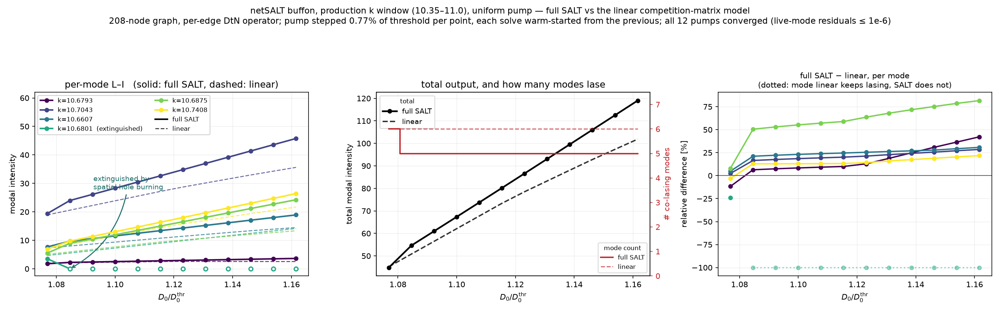
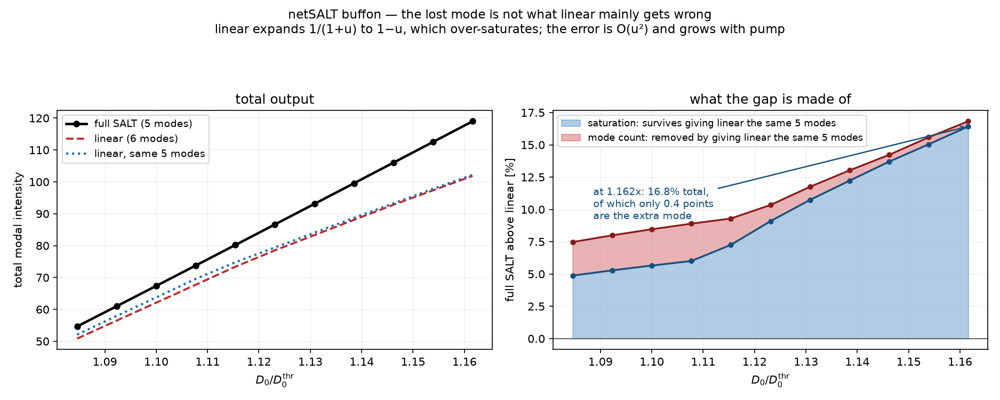
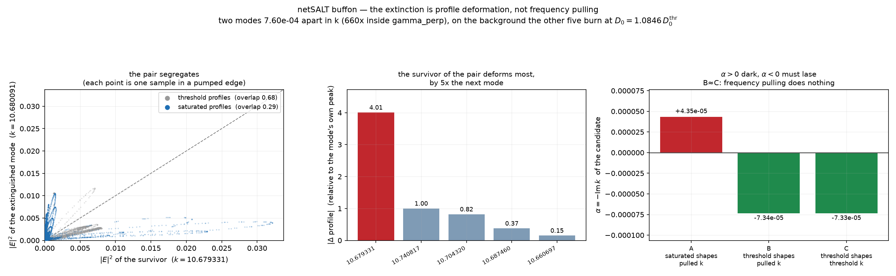
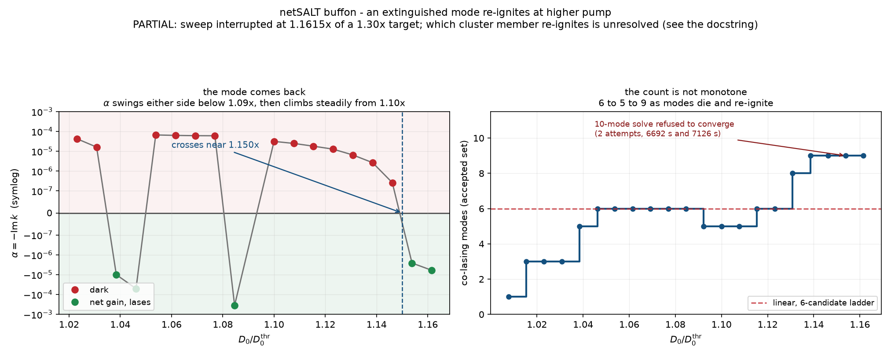
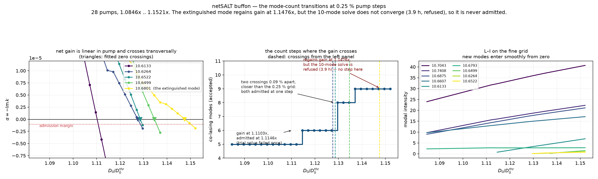

# Mode competition on the buffon: full SALT against the linear model

A kept record of where netsalt's two above-threshold solvers disagree on the
buffon, and why. The figures cost several hours of solver time each, so they and
the small arrays they were drawn from live here rather than being regenerated on
demand. Everything is reproducible — see [Reproducing](#reproducing).

The short version: the two models disagree about **which** modes lase and about
**how much** power comes out, and the second disagreement is the larger one and
the one that grows.

## The fixture

`examples/buffon/buffon_competition` — the buffon over the production `k` window
(10.35–11.0, Weyl ≈ 778 modes), uniform pump, candidate set capped at 12, on the
per-edge DtN operator (`intensity_method: full_salt_varying`), 208 nodes.

All twelve candidate thresholds land within **4.7 %** of each other
(0.003046 … 0.003189), so which modes lase is settled by how they burn each
other's gain, not by threshold ordering. That is the regime the Nat. Commun.
paper works in, and it is why this fixture exists.

Pump ladder: 12 points from 1.0769× to 1.1616× the lowest threshold, stepped
0.77 % at a time, each solve warm-started from the previous one. Every pump
converged; the live modes' residuals are ≤ 1e-6 throughout.

## 1. The L–I curves



Full SALT lases **six** modes at 1.0769× and **five** from 1.0846× on. The linear
competition matrix keeps all six and grows the sixth (`k = 10.6801`) from 4.67 to
14.16 across the ladder.

On the surviving modes full SALT sits above linear, and the gap widens with pump:

| k | SALT vs linear, 1.077× → 1.162× |
| --- | --- |
| 10.6875 | +8.0 % → **+81.6 %** |
| 10.6793 | −11.7 % → +42.2 % |
| 10.6607 | +4.8 % → +30.7 % |
| 10.7043 | +2.4 % → +28.5 % |
| 10.7408 | −3.2 % → +21.8 % |
| 10.6801 | −24.1 % → **extinguished** |

## 2. The lost mode is not the main error



The obvious reading of the table above — linear spreads the gain over six modes
instead of five — is wrong. Strike the extinguished mode from linear's
*candidate set* and re-run it on the same grid:

| D0/thr | SALT vs linear-6 | SALT vs linear-5 |
| --- | --- | --- |
| 1.0846 | +7.5 % | +4.9 % |
| 1.1077 | +8.9 % | +6.0 % |
| 1.1308 | +11.8 % | +10.7 % |
| 1.1616 | +16.8 % | **+16.4 %** |

At the top of the range, correcting the mode count recovers **0.4 of the 16.8
points**. What linear misses is that full SALT extracts more power from the same
pump, by a margin growing monotonically with it.

The sign is forced by the algebra. Linear expands the hole-burning denominator
to first order, `1/(1+u) ≈ 1 − u`, and `1/(1+u) > 1 − u` for every `u > 0`, so the
expansion always *overestimates* gain depletion, clamps too hard and
under-predicts output. The error is `O(u²)` — quadratic in intensity — which is
the observed +4.9 % → +16.4 % across an 8 % pump range.

It is not a uniform rescaling either: at 1.0846× the per-mode spread against
linear-5 runs −11 % … +20 %, so gain is *redistributed* between modes, not just
added to all of them.

## 3. Why the mode is lost: profile deformation



`net_gain_alpha` takes the saturated background as an argument, so the background
can be built the way *either* model would build it — same five amplitudes, same
pump — and the candidate's net gain read off each. `α = −Im k`; `α < 0` means net
gain, so the mode must lase.

| background | profiles | k | α | verdict |
| --- | --- | --- | --- | --- |
| A | saturated | pulled | +4.3482e-05 | dark |
| B | threshold | pulled | −7.3351e-05 | lases |
| C | threshold | threshold | −7.3341e-05 | lases |

**B and C agree to four significant figures** (0.01 %), so frequency pulling
contributes essentially nothing. The whole swing is profile deformation.

What that deformation is: the extinguished mode's near-degenerate partner
deforms by **400 % of its own peak**, five times more than any other mode in the
set, and the pair's pump-weighted overlap **collapses from 0.68 to 0.29**.

So two modes that are spatially near-identical at threshold — 7.60e-04 apart in
`k`, 660× inside `gamma_perp = 0.5`, 68 % overlap — **segregate** under
saturation. The winner reshapes to capture the pump-rich region; the loser is
left with the depleted remainder and starves. The left panel shows it directly:
at threshold (grey) the two modes' sample intensities track the diagonal, and
saturated (blue) they splay onto the axes.

A competition matrix built once from threshold profiles sees only the 68 % and
cannot represent any of this, in principle rather than by approximation.

## 4. The existing conditioning warning does not catch it

`compute_modal_intensities` warns when the competition submatrix is
ill-conditioned, on the reasoning that a near-degenerate pair leaves the split
between its members unresolvable. Here it stays quiet, and is right to by its own
measure: `competition_conditioning` is **19.3** over all 12 candidates and
**2.4** restricted to the pair linear gets wrong.

The failure is not ill-conditioning of `T`. It is that `T` — threshold profiles,
first-order saturation — is the wrong operator, and no conditioning test on `T`
can detect that.

## 5. The extinguished mode re-ignites



An extinguished mode is dark because the survivors burnt a hole where it lives.
Their profiles keep deforming as the pump rises, so nothing forbids its net gain
climbing back through zero. §3's mechanism predicted it would not — deformation
grows with pump, and deformation is what killed it, so it should get *more*
dark.

**That prediction is wrong.** Running the sweep that admits and drops modes by
net gain (`probe_mode_reignition.py`, which re-screens every candidate at every
pump, dropped ones included) and reading the α of the extinguished mode's
branch:

| D0/thr | α | |
| --- | --- | --- |
| 1.0846 | +6.06e-05 | dark |
| 1.1000 | +3.15e-05 | dark |
| 1.1154 | +1.81e-05 | dark |
| 1.1308 | +6.53e-06 | dark |
| 1.1385 | +2.68e-06 | dark |
| 1.1462 | +2.62e-07 | dark |
| **1.1538** | **−2.59e-06** | **lases** |
| 1.1615 | −5.98e-06 | lases |

From 1.10× the α decays smoothly across two orders of magnitude and crosses zero
near **1.150×**. The hole does not deepen over the loser indefinitely: past a
point the winner reshapes away from it and the loser recovers.

Below 1.09× the same α swings either side of zero several times, so this is not
one extinction and one return — the cluster goes in and out repeatedly.

**The mode count is correspondingly non-monotone**: about 6 at 1.085×, dipping
to 5, then climbing to **9** by 1.1385×, as modes both die and re-ignite. Linear,
which cannot extinguish a mode once it has won, has no mechanism for any of this.

### What this does not establish

* **Which cluster member re-ignites is unresolved.** From 1.1000× on, probes
  started at k = 10.680054 and k = 10.679976 return *identical* α to five
  significant figures — both root finds converge to the same root. The test says
  a mode at k ≈ 10.68005 regains gain, not which one.
* **The crossing location wants finer steps.** α at 1.1462× is 2.6e-07, about
  100x the noise floor measured on converged incumbents (~1e-9). The sign is
  solid; 1.150× is bracketed only to within one 0.77 % pump step.
* **These backgrounds are not the ladder's.** This sweep admits by net gain from
  the bottom, so its active set at a given pump differs from §1's forced
  6-candidate ladder. At 1.0846× it finds k = 10.68009 with net gain where the
  ladder found it dark — different background, not a contradiction. Whether a
  mode lases depends on which set already does, which is the multistability point
  below showing up in the data.
* **The sweep is partial.** It was interrupted at 1.1615× of a 1.30× target and
  never wrote its final intensities; the α log is what survived. A 10-mode solve
  at 1.1538× refused to converge on two attempts, 6692 s and 7126 s, against
  ~1000 s for 9 modes — that is the current cost wall.

## 6. The transitions, at 0.25 % steps — nothing actually jumps



§5's count moved 6 → 5 → 9 in steps that looked abrupt, and it was reconstructed
from *solve attempts* in a log rather than from accepted sets — the grow step
accepts a set only if every amplitude clears the lasing floor **and** the
residuals pass, so a solve can report converged and still be rejected.
`sweep_fine_transitions.py` records the accepted set directly and steps at
0.25 %, three times finer, seeding from the converged five-mode state at 1.0846×
so the fine grid is affordable.

**Underneath every transition, net gain is linear in pump and crosses zero
transversally.** For `k = 10.6133` the successive α differences over six pumps
are −5.68, −5.66, −5.66, −5.64, −5.63, −5.62 (×1e-6 per step) — a straight line
to four figures. Fitted crossings:

| k | crosses at | dα/d(D0/thr) | departure from linear |
| --- | --- | --- | --- |
| 10.6264 | 1.1276× | −8.46e-04 | 10.8 % |
| 10.6522 | 1.1286× | −1.23e-03 | 2.2 % |
| 10.6499 | 1.1347× | — | — |
| 10.6133 | 1.1103× | −2.26e-03 | 0.1 % |
| 10.6801 | **1.1476×** | −3.98e-04 | 1.4 % |

So the apparent jumps were three effects stacked on smooth physics:

* **Counting is discrete.** A mode either lases or does not; the underlying α is
  continuous.
* **Two crossings closer than the grid.** `k = 10.6264` crosses at 1.1276× and
  `k = 10.6522` at 1.1286× — **0.09 % of threshold apart**, against a 0.25 %
  grid, so both are admitted in one step and the count appears to jump by two.
  They are not degenerate in threshold, merely closer together than the
  resolution.
* **Admission lags the physics by up to a step.** `k = 10.6133` crosses at
  1.1103× and is past the −1e-6 admission margin by 1.1121×, but is only
  accepted at 1.1146×: the trial solve at 1.1121× failed, which shows in that
  pump costing 348 s against a typical 145 s. That lag is a solver property, not
  a laser one.

And the 6 → 5 dip of §5 **did not reproduce**: at 0.25 % the count is a flat 5
from 1.0846× to 1.1121× and then rises monotonically. Note this sweep also
starts from a different seed, so step size and branch both changed — what is
established is that the dip is not robust, not which of the two caused it.

### The re-ignition is confirmed, and cannot be followed

The extinguished mode's α crosses zero at **1.1476×** (linear to 1.4 % over the
six approaching pumps), confirming §5 and pinning it to ±0.25 %. At 1.1521× it
is past the admission margin, the sweep tried to admit it — and the ten-mode
solve ran **14137 s (3.9 h) and failed**. The accepted count stayed at 9.

That is the same wall §5 hit twice at 1.1538× (6692 s, 7126 s), and it is now
clear it is not bad luck: **it sits exactly where the re-ignited mode has to
join.** The physics says ten modes lase above 1.1476×; the solver cannot produce
that solution. Until M = 10 converges, this fixture cannot be followed past ~1.15×.

## Open questions

* **Which mode re-ignites, and exactly where.** §5 answers the yes/no; it does
  not separate the members of the near-degenerate cluster, because both probes
  land on the same root. Resolving that needs a k window narrow enough to keep
  them apart, and finer pump steps around 1.150x.
* **Above 1.16x.** The sweep never got there. Whether the count keeps climbing,
  and whether the re-ignited mode stays on, is unmeasured.
* ~~**The M = 10 wall.**~~ **Fixed** — see `AUDIT.md` §15. It was not a cost wall
  that scales with mode count but a seeding bug: the solver initialised its
  hole-burning field from the *unsaturated* operator even when handed a converged
  warm start, which put the ten-mode solve on its `k` bound, triggered a cold
  restart to `a ~ 0`, and left it unable to climb back within its iteration
  budget. Settling the field at the seed first turns the three failures
  (6692 s, 7126 s, 14137 s) into **296 s, converged, 9 iterations**, with the
  tenth mode entering at `k = 10.680007`, `a = 0.1334`. **Every figure and
  number in this README was produced before that fix**, so the sweeps here stop
  at ~1.15x for a reason that no longer applies; they are worth re-running
  further up.
* **Hysteresis.** Sweeping down from the top state and comparing counts at the
  same pumps would separate "the branch matters" from "the step size mattered",
  which §6 could not: its seed differed from §5's as well as its resolution.
* **It is a triplet, not a pair.** `k = 10.6793, 10.6800, 10.6801` all sit inside
  1e-3, and the third turns on at 1.0355×. Three modes competing for the same
  gain is a richer situation than the two-mode picture above.
* **Does this repeat higher up?** These are the 6 lowest-threshold candidates of
  12 — the bottom of the paper's L–I curve. Whether each near-degenerate pair
  extinguishes as modes 7–12 turn on is untested, and would decide whether
  linear's mode count drifts further from SALT's the harder you pump.
* **Bistability.** When the solver dropped a mode it sometimes dropped the *other*
  member of the pair and still converged. If both five-mode states are stable at
  the same pump, that is bistability — which linear cannot have, its solution
  being unique by construction.

## Reproducing

From the repository root, after building the fixture once:

```bash
cd examples/buffon/buffon_competition && bash run.sh   # builds out/
```

then, from anywhere (each script chdirs to the fixture itself):

```bash
python examples/audit/sweep_pump_ladder.py 1.0769 0.0077 12 80 6   # ~1 h -> out/ladder.npz
python examples/audit/plot_pump_ladder.py                          # figure 1
python examples/audit/compare_linear_same_modes.py                 # seconds -> out/linear_same_modes.npz
python examples/audit/plot_linear_gap.py                           # figure 2
python examples/audit/probe_extinction_mechanism.py                # ~5 min -> out/extinction_mechanism.npz
python examples/audit/plot_extinction_mechanism.py                 # figure 3
python examples/audit/probe_mode_reignition.py 1.30 40             # hours -> out/reignite_alpha.npy
python examples/audit/plot_reignition.py                           # figure 4
python examples/audit/sweep_fine_transitions.py 1.16 0.25          # ~7 h -> out/fine_transitions.npz
python examples/audit/plot_fine_transitions.py                     # figure 5
```

`data/` holds the arrays these figures were drawn from, so they can be redrawn
without repeating the sweeps. `extinction_mechanism.npz` there is reduced —
pumped samples only, thinned 4x, float32 — against 8.9 MB for the full array the
probe writes.

Narrative and the surrounding audit: `AUDIT.md` §§12–14.
