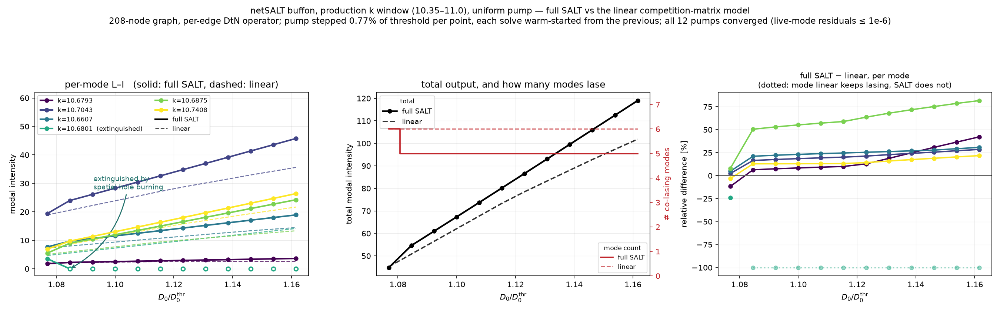
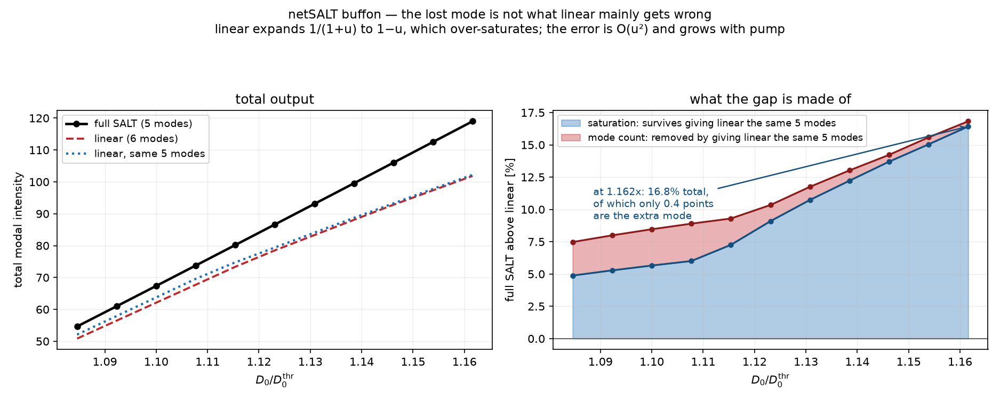
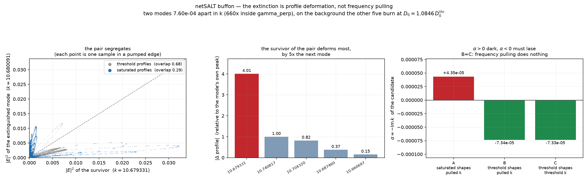
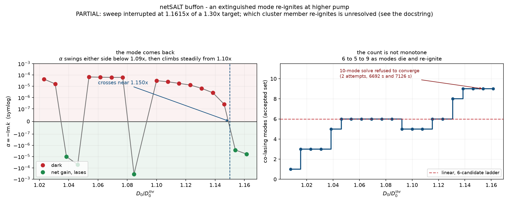
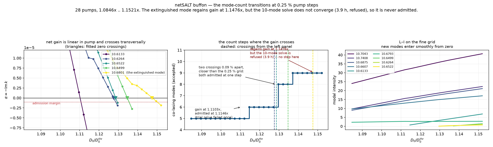

# Mode competition on the buffon: full SALT against the linear model

A kept record of where netsalt's two above-threshold solvers disagree on the
buffon, and why. The figures cost several hours of solver time each, so they and
the small arrays they were drawn from live here rather than being regenerated on
demand. Everything is reproducible — see [Reproducing](#reproducing).

The short version: the two models disagree about **which** modes lase and about
**how much** power comes out, and the second disagreement is the larger one and
the one that grows.

## The fixture

`examples/buffon/buffon_competition` — the buffon over the production `k` window
(10.35–11.0, Weyl ≈ 778 modes), uniform pump, candidate set capped at 12, on the
per-edge DtN operator (`intensity_method: full_salt_varying`), 208 nodes.

All twelve candidate thresholds land within **4.7 %** of each other
(0.003046 … 0.003189), so which modes lase is settled by how they burn each
other's gain, not by threshold ordering. That is the regime the Nat. Commun.
paper works in, and it is why this fixture exists.

Pump ladder: 12 points from 1.0769× to 1.1616× the lowest threshold, stepped
0.77 % at a time, each solve warm-started from the previous one. Every pump
converged; the live modes' residuals are ≤ 1e-6 throughout.

## 1. The L–I curves



Full SALT lases **six** modes at 1.0769× and **five** from 1.0846× on. The linear
competition matrix keeps all six and grows the sixth (`k = 10.6801`) from 4.67 to
14.16 across the ladder.

On the surviving modes full SALT sits above linear, and the gap widens with pump:

| k | SALT vs linear, 1.077× → 1.162× |
| --- | --- |
| 10.6875 | +8.0 % → **+81.6 %** |
| 10.6793 | −11.7 % → +42.2 % |
| 10.6607 | +4.8 % → +30.7 % |
| 10.7043 | +2.4 % → +28.5 % |
| 10.7408 | −3.2 % → +21.8 % |
| 10.6801 | −24.1 % → **extinguished** |

## 2. The lost mode is not the main error



The obvious reading of the table above — linear spreads the gain over six modes
instead of five — is wrong. Strike the extinguished mode from linear's
*candidate set* and re-run it on the same grid:

| D0/thr | SALT vs linear-6 | SALT vs linear-5 |
| --- | --- | --- |
| 1.0846 | +7.5 % | +4.9 % |
| 1.1077 | +8.9 % | +6.0 % |
| 1.1308 | +11.8 % | +10.7 % |
| 1.1616 | +16.8 % | **+16.4 %** |

At the top of the range, correcting the mode count recovers **0.4 of the 16.8
points**. What linear misses is that full SALT extracts more power from the same
pump, by a margin growing monotonically with it.

The sign is forced by the algebra. Linear expands the hole-burning denominator
to first order, `1/(1+u) ≈ 1 − u`, and `1/(1+u) > 1 − u` for every `u > 0`, so the
expansion always *overestimates* gain depletion, clamps too hard and
under-predicts output. The error is `O(u²)` — quadratic in intensity — which is
the observed +4.9 % → +16.4 % across an 8 % pump range.

It is not a uniform rescaling either: at 1.0846× the per-mode spread against
linear-5 runs −11 % … +20 %, so gain is *redistributed* between modes, not just
added to all of them.

## 3. Why the mode is lost: profile deformation



`net_gain_alpha` takes the saturated background as an argument, so the background
can be built the way *either* model would build it — same five amplitudes, same
pump — and the candidate's net gain read off each. `α = −Im k`; `α < 0` means net
gain, so the mode must lase.

| background | profiles | k | α | verdict |
| --- | --- | --- | --- | --- |
| A | saturated | pulled | +4.3482e-05 | dark |
| B | threshold | pulled | −7.3351e-05 | lases |
| C | threshold | threshold | −7.3341e-05 | lases |

**B and C agree to four significant figures** (0.01 %), so frequency pulling
contributes essentially nothing. The whole swing is profile deformation.

What that deformation is: the extinguished mode's near-degenerate partner
deforms by **400 % of its own peak**, five times more than any other mode in the
set, and the pair's pump-weighted overlap **collapses from 0.9995 to 0.29**.

*(An earlier version of this section gave the threshold overlap as 0.68. That was
computed inconsistently — the dying mode's field evaluated on a saturated
background against the partner's threshold shape. Taken consistently, both from
the unsaturated operator, it is 0.9995; see §8. The collapse is larger than
first reported, not smaller.)*

So two modes that are spatially **the same mode** at threshold — 7.60e-04 apart
in `k`, 660× inside `gamma_perp = 0.5`, 99.95 % overlap — **segregate** under
saturation. The winner reshapes to capture the pump-rich region; the loser is
left with the depleted remainder and starves. The left panel shows it directly:
at threshold (grey) the two modes' sample intensities track the diagonal, and
saturated (blue) they splay onto the axes.

A competition matrix built once from threshold profiles sees only the 68 % and
cannot represent any of this, in principle rather than by approximation.

## 4. The existing conditioning warning does not catch it

`compute_modal_intensities` warns when the competition submatrix is
ill-conditioned, on the reasoning that a near-degenerate pair leaves the split
between its members unresolvable. Here it stays quiet, and is right to by its own
measure: `competition_conditioning` is **19.3** over all 12 candidates and
**2.4** restricted to the pair linear gets wrong.

The failure is not ill-conditioning of `T`. It is that `T` — threshold profiles,
first-order saturation — is the wrong operator, and no conditioning test on `T`
can detect that.

## 5. The extinguished mode re-ignites



An extinguished mode is dark because the survivors burnt a hole where it lives.
Their profiles keep deforming as the pump rises, so nothing forbids its net gain
climbing back through zero. §3's mechanism predicted it would not — deformation
grows with pump, and deformation is what killed it, so it should get *more*
dark.

**That prediction is wrong.** Running the sweep that admits and drops modes by
net gain (`probe_mode_reignition.py`, which re-screens every candidate at every
pump, dropped ones included) and reading the α of the extinguished mode's
branch:

| D0/thr | α | |
| --- | --- | --- |
| 1.0846 | +6.06e-05 | dark |
| 1.1000 | +3.15e-05 | dark |
| 1.1154 | +1.81e-05 | dark |
| 1.1308 | +6.53e-06 | dark |
| 1.1385 | +2.68e-06 | dark |
| 1.1462 | +2.62e-07 | dark |
| **1.1538** | **−2.59e-06** | **lases** |
| 1.1615 | −5.98e-06 | lases |

From 1.10× the α decays smoothly across two orders of magnitude and crosses zero
near **1.150×**. The hole does not deepen over the loser indefinitely: past a
point the winner reshapes away from it and the loser recovers.

Below 1.09× the same α swings either side of zero several times, so this is not
one extinction and one return — the cluster goes in and out repeatedly.

**The mode count is correspondingly non-monotone**: about 6 at 1.085×, dipping
to 5, then climbing to **9** by 1.1385×, as modes both die and re-ignite. Linear,
which cannot extinguish a mode once it has won, has no mechanism for any of this.

### What this does not establish

* **Which cluster member re-ignites is unresolved.** From 1.1000× on, probes
  started at k = 10.680054 and k = 10.679976 return *identical* α to five
  significant figures — both root finds converge to the same root. The test says
  a mode at k ≈ 10.68005 regains gain, not which one.
* **The crossing location wants finer steps.** α at 1.1462× is 2.6e-07, about
  100x the noise floor measured on converged incumbents (~1e-9). The sign is
  solid; 1.150× is bracketed only to within one 0.77 % pump step.
* **These backgrounds are not the ladder's.** This sweep admits by net gain from
  the bottom, so its active set at a given pump differs from §1's forced
  6-candidate ladder. At 1.0846× it finds k = 10.68009 with net gain where the
  ladder found it dark — different background, not a contradiction. Whether a
  mode lases depends on which set already does, which is the multistability point
  below showing up in the data.
* **The sweep is partial.** It was interrupted at 1.1615× of a 1.30× target and
  never wrote its final intensities; the α log is what survived. A 10-mode solve
  at 1.1538× refused to converge on two attempts, 6692 s and 7126 s, against
  ~1000 s for 9 modes — that is the current cost wall.

## 6. The transitions, at 0.25 % steps — nothing actually jumps



§5's count moved 6 → 5 → 9 in steps that looked abrupt, and it was reconstructed
from *solve attempts* in a log rather than from accepted sets — the grow step
accepts a set only if every amplitude clears the lasing floor **and** the
residuals pass, so a solve can report converged and still be rejected.
`sweep_fine_transitions.py` records the accepted set directly and steps at
0.25 %, three times finer, seeding from the converged five-mode state at 1.0846×
so the fine grid is affordable.

**Underneath every transition, net gain is linear in pump and crosses zero
transversally.** For `k = 10.6133` the successive α differences over six pumps
are −5.68, −5.66, −5.66, −5.64, −5.63, −5.62 (×1e-6 per step) — a straight line
to four figures. Fitted crossings:

| k | crosses at | dα/d(D0/thr) | departure from linear |
| --- | --- | --- | --- |
| 10.6264 | 1.1276× | −8.46e-04 | 10.8 % |
| 10.6522 | 1.1286× | −1.23e-03 | 2.2 % |
| 10.6499 | 1.1347× | — | — |
| 10.6133 | 1.1103× | −2.26e-03 | 0.1 % |
| 10.6801 | **1.1476×** | −3.98e-04 | 1.4 % |

So the apparent jumps were three effects stacked on smooth physics:

* **Counting is discrete.** A mode either lases or does not; the underlying α is
  continuous.
* **Two crossings closer than the grid.** `k = 10.6264` crosses at 1.1276× and
  `k = 10.6522` at 1.1286× — **0.09 % of threshold apart**, against a 0.25 %
  grid, so both are admitted in one step and the count appears to jump by two.
  They are not degenerate in threshold, merely closer together than the
  resolution.
* **Admission lags the physics by up to a step.** `k = 10.6133` crosses at
  1.1103× and is past the −1e-6 admission margin by 1.1121×, but is only
  accepted at 1.1146×: the trial solve at 1.1121× failed, which shows in that
  pump costing 348 s against a typical 145 s. That lag is a solver property, not
  a laser one.

And the 6 → 5 dip of §5 **did not reproduce**: at 0.25 % the count is a flat 5
from 1.0846× to 1.1121× and then rises monotonically. Note this sweep also
starts from a different seed, so step size and branch both changed — what is
established is that the dip is not robust, not which of the two caused it.

### The re-ignition is confirmed, and cannot be followed

The extinguished mode's α crosses zero at **1.1476×** (linear to 1.4 % over the
six approaching pumps), confirming §5 and pinning it to ±0.25 %. At 1.1521× it
is past the admission margin, the sweep tried to admit it — and the ten-mode
solve ran **14137 s (3.9 h) and failed**. The accepted count stayed at 9.

That is the same wall §5 hit twice at 1.1538× (6692 s, 7126 s), and it is now
clear it is not bad luck: **it sits exactly where the re-ignited mode has to
join.** The physics says ten modes lase above 1.1476×; the solver cannot produce
that solution. Until M = 10 converges, this fixture cannot be followed past ~1.15×.

## Open questions

* **Which mode re-ignites, and exactly where.** §5 answers the yes/no; it does
  not separate the members of the near-degenerate cluster, because both probes
  land on the same root. Resolving that needs a k window narrow enough to keep
  them apart, and finer pump steps around 1.150x.
* **Above 1.16x.** The sweep never got there. Whether the count keeps climbing,
  and whether the re-ignited mode stays on, is unmeasured.
* ~~**The M = 10 wall.**~~ **Fixed** — see `AUDIT.md` §15. It was not a cost wall
  that scales with mode count but a seeding bug: the solver initialised its
  hole-burning field from the *unsaturated* operator even when handed a converged
  warm start, which put the ten-mode solve on its `k` bound, triggered a cold
  restart to `a ~ 0`, and left it unable to climb back within its iteration
  budget. Settling the field at the seed first turns the three failures
  (6692 s, 7126 s, 14137 s) into **296 s, converged, 9 iterations**, with the
  tenth mode entering at `k = 10.680007`, `a = 0.1334`. **Every figure and
  number in this README was produced before that fix**, so the sweeps here stop
  at ~1.15x for a reason that no longer applies; they are worth re-running
  further up.
* **Hysteresis.** Sweeping down from the top state and comparing counts at the
  same pumps would separate "the branch matters" from "the step size mattered",
  which §6 could not: its seed differed from §5's as well as its resolution.
* **It is a triplet, not a pair.** `k = 10.6793, 10.6800, 10.6801` all sit inside
  1e-3, and the third turns on at 1.0355×. Three modes competing for the same
  gain is a richer situation than the two-mode picture above.
* **Does this repeat higher up?** These are the 6 lowest-threshold candidates of
  12 — the bottom of the paper's L–I curve. Whether each near-degenerate pair
  extinguishes as modes 7–12 turn on is untested, and would decide whether
  linear's mode count drifts further from SALT's the harder you pump.
* **Bistability.** When the solver dropped a mode it sometimes dropped the *other*
  member of the pair and still converged. If both five-mode states are stable at
  the same pump, that is bistability — which linear cannot have, its solution
  being unique by construction.

## Reproducing

From the repository root, after building the fixture once:

```bash
cd examples/buffon/buffon_competition && bash run.sh   # builds out/
```

then, from anywhere (each script chdirs to the fixture itself):

```bash
python examples/audit/sweep_pump_ladder.py 1.0769 0.0077 12 80 6   # ~1 h -> out/ladder.npz
python examples/audit/plot_pump_ladder.py                          # figure 1
python examples/audit/compare_linear_same_modes.py                 # seconds -> out/linear_same_modes.npz
python examples/audit/plot_linear_gap.py                           # figure 2
python examples/audit/probe_extinction_mechanism.py                # ~5 min -> out/extinction_mechanism.npz
python examples/audit/plot_extinction_mechanism.py                 # figure 3
python examples/audit/probe_mode_reignition.py 1.30 40             # hours -> out/reignite_alpha.npy
python examples/audit/plot_reignition.py                           # figure 4
python examples/audit/sweep_fine_transitions.py 1.16 0.25          # ~7 h -> out/fine_transitions.npz
python examples/audit/plot_fine_transitions.py                     # figure 5
```

`data/` holds the arrays these figures were drawn from, so they can be redrawn
without repeating the sweeps. `extinction_mechanism.npz` there is reduced —
pumped samples only, thinned 4x, float32 — against 8.9 MB for the full array the
probe writes.

Narrative and the surrounding audit: `AUDIT.md` §§12–14.

## 7. The jump before 1.085x is a first-order mode switch

The small jump in §1's L–I just below 1.085x is not under-resolution. Resolving
it at **0.05 % steps** — ten times finer than the step that produced it — makes
it *sharper*, not smoother, and shows why.

**The dying mode's intensity is still rising when its branch ends.** At 1.0750x,
1.0755x and 1.0760x the mode at `k = 10.6801` carries a = 3.445, 3.47, 3.50; at
1.0765x the six-mode solve stops converging altogether, and by 1.0800x the
five-mode set converges without it. A branch that ends while its amplitude is
finite and growing is a **fold**, not a continuous switch-off.

**Both branches exist over a window.** Solving the five- and six-mode sets at the
same pumps, and asking `net_gain_alpha` what the sixth mode does on the
five-mode background:

| pump | six-mode | five-mode | α of the sixth on the five-mode state |
| --- | --- | --- | ---: |
| 1.0700 | converges, a=3.157 | converges | −1.35e-04 net gain |
| 1.0730 | converges, a=3.334 | converges | −1.47e-04 net gain |
| 1.0740 | — | converges | +5.07e-05 lossy (min over all candidates) |
| 1.0760 | converges, a=3.499 | converges | +4.94e-05 lossy |
| 1.0765 | **fails** (a → 2.586) | converges | +4.91e-05 lossy |
| 1.0780 | **fails** (a → 2.584) | converges | +4.81e-05 lossy |

Below ~1.0735x the five-mode state is not a steady state at all — the sixth mode
has net gain on it and must rejoin. Above the fold at ~1.0763x the six-mode
branch is gone. **Between them both are stable.**

**Hysteresis confirms it**, and needs no continuation through the fold.
Sweeping the pump back *down* from the five-mode state (`probe_hysteresis.py`),
five modes hold from 1.0800x all the way to 1.0740x, and only at 1.0730x does a
mode regain net gain and have to rejoin — which the all-candidate stability scan
below confirms is a real root appearing, not a probe artefact. So:

* sweeping **up**, the laser holds six modes to ~1.0763x, then drops to five;
* sweeping **down**, it holds five modes to ~1.0735x, then jumps back to six.

A hysteresis loop **~0.3 % of threshold wide**. The survivors' +20 % to +54 %
jump at the switch is the gain of the extinguished mode being redistributed in
one step.

This is the sharpest qualitative failure of the linear model in this document.
Its solution is **unique by construction** — a linear complementarity problem
with a fixed competition matrix — so it has no second branch to be trapped on,
no fold, and no history dependence. It cannot produce a hysteresis loop at all,
at any pump, on any graph.

### How the window's lower edge is set, and a correction

The lower edge is not the five-mode state gradually gaining stability. **A root
annihilates.** Probing *every* candidate on the five-mode background
(`probe_state_stability.py`):

| pump | five-mode state | the cluster near 10.6800 |
| --- | --- | --- |
| 1.0700 | **unstable** | root 10.680071, α = −1.354e-04 (net gain) |
| 1.0720 | **unstable** | root 10.680070, α = −1.434e-04 |
| 1.0730 | **unstable** | root 10.680069, α = −1.474e-04 |
| 1.0740 | stable | both probes now find **one** root, 10.679989, α = +5.07e-05 |
| 1.0750 | stable | one root, α = +5.00e-05 |
| 1.0760 | stable | one root, α = +4.94e-05 |

Below 1.0740x two roots sit near 10.6800 — one with net gain at ~10.68007, one
lossy at ~10.679988 — and probes started 1.5e-05 apart land on either. At and
above 1.0740x *both probes converge to the same root*. The net-gain root has not
drifted away; it has **merged with its lossy partner and annihilated**. That is
a saddle-node in the root structure: the same bifurcation as the fold, seen from
the five-mode side.

**A correction.** An earlier version of this section reported the +5.13e-05 at
1.0730x as simply *wrong* and attributed it to a non-reproducible run. That is
itself wrong twice over. Re-running the fold test verbatim reproduces it bit for
bit, and the solver is not path dependent — the same five-mode solve run cold,
after a six-mode solve, and cold again gives identical states and identical α,
with the cubic resampling cache empty throughout. The real explanation is that
the probe answered about the *other* root of the pair, which genuinely is lossy.

Both numbers were right. What was wrong was reading a single `net_gain_alpha`
call as a verdict on a *state*: it reports what the root nearest `k0` does, and
a state is unstable if **any** root has net gain. Stability is the minimum α
over all candidates. Where the spectrum is this dense, one probe cannot decide
it — and this is the second time in this document that the cluster near 10.6800
has produced a result that looked like a solver problem and was not.

The caveat that remains: `conv=False` is evidence a branch has ended, but it is
also what solver trouble looks like. What supports the fold reading is the
combination — amplitude rising to the last converged pump, the five-mode state
simultaneously stable there, failure reproducing above the fold and at none of
the pumps below, and the failed solves drifting to a ≈ 2.58 (below the 3.50 they
had been climbing), which is what losing a stable branch to its unstable partner
looks like near a saddle-node. Proving a fold outright needs continuation
*through* the turning point — pseudo-arclength — which this solver does not do.


## 8. Spatial overlap predicts where this happens, and it happens twice

Does the switch of §7 repeat for other pairs? The criterion is not proximity in
`k`: `gamma_perp = 0.5` puts even the widest gap among these twelve candidates
220x inside the gain linewidth, so every pair competes for gain. What singles a
pair out is occupying the *same space*.

Pump-weighted overlap over all 66 pairs of threshold modes
(`probe_mode_overlaps.py`):

| overlap | k_m | k_n | \|dk\| | |
| ---: | --- | --- | ---: | --- |
| 1.0000 | 10.680091 | 10.679976 | 1.16e-04 | the triplet |
| 0.9997 | 10.679331 | 10.679976 | 6.44e-04 | " |
| **0.9995** | **10.679331** | **10.680091** | 7.60e-04 | **the §7 pair** |
| **0.9706** | **10.704320** | **10.707383** | 3.06e-03 | **a second pair** |
| 0.5620 | 10.679331 | 10.649905 | 2.94e-02 | — and then a cliff |

**The cluster at 10.680 is spatially one mode**, its members overlapping at
0.9995–1.0000. That is why saturation has to resolve them by segregating, and
why the resolution is so violent.

**The pattern repeats, exactly where overlap says it should.** The pair
`10.704320 / 10.707383` stands alone in fourth place at 0.9706, every remaining
pair being below 0.57 — and it is precisely the pair in trouble at the top of the
sweep. `k = 10.7043` is the *strongest* mode in the laser (a = 101.45 at
1.4596x); `k = 10.7074` fell 0.44 → 0.21 between 1.2796x and 1.4596x and is what
the eleven-mode solve could not hold. Same mechanism, second-most-overlapping
pair, 0.38x further up the pump.

Spacing would have missed it: the second pair is **four times wider apart in `k`**
than the first and belongs to no near-degenerate cluster. Sorted by spacing this
fixture has exactly one cluster, so a spacing-based heuristic predicts one switch
and there are two.

**Consequence for the cost wall.** Per-pump cost near 1.46x ran 500 s → 8748 s →
26001 s with the eleven-mode solve never converging. On this reading that is not
a solver defect but the same extinction physics — there is no eleven-mode
solution to find once 10.7074 has gone — and the sweep should drop the mode
rather than spend hours holding it. The ten-mode solve testing that is still
running.


## 9. The second switch is a different kind of switch

§8 predicted, from spatial overlap alone, that `10.704320 / 10.707383` would be
the next pair to fight. It is — and the fight ends differently.

Crossing it at 0.05 % and 0.15 % steps (`sweep_fine_transitions.py` resumed into
`out/fine_switch2.npz`), the dying mode's intensity falls **linearly**:

| D0/thr | a(k = 10.7074) |
| --- | ---: |
| 1.4596 | 0.211732 |
| 1.4601 | 0.207523 |
| 1.4606 | 0.203286 |
| 1.4611 | 0.199027 |
| 1.4616 | 0.194746 |
| 1.4621 | 0.190443 |
| 1.4636 | 0.177397 |

| 1.4651 | 0.164149 |
| 1.4666 | 0.150688 |
| 1.4681 | 0.137031 |
| 1.4696 | 0.123165 |
| 1.4711 | 0.109093 |

Over the first seven points this looked exactly straight — slope −8.583 per unit
pump, maximum deviation 1.07e-04, 0.05 % — and an extrapolated zero at 1.4843x.
Twelve points over twice the range show it is not straight: the decline
*accelerates*, and the straight-line fit now deviates by 6.9e-04.

That is an ordinary second-order switch-off, and it is *not* what the first
switch did. There the dying mode's amplitude was still **rising** (3.445 → 3.50)
when its branch ceased to exist. Side by side:

| | pair 1 — overlap 0.9995 | pair 2 — overlap 0.9706 |
| --- | --- | --- |
| approach | amplitude **rising** | amplitude **falling**, linearly |
| ends by | the branch folding away | reaching zero at 1.4843x |
| bistable window | yes, ~0.28 % wide | none expected |
| hysteresis | yes | no |

So **high spatial overlap predicts that two modes will fight; it does not predict
how the fight ends.** One pair resolves by a fold with a hysteresis loop, the
other by a continuous extinction, and the only structural difference between
them is 0.9995 against 0.9706 overlap.

### The exponent, which is what actually separates the two cases

"Falls linearly" was the wrong way to put the distinction, and over a wider range
it is also not quite true. Fit `a ~ A (D0_c − D0)^p`
(`examples/audit/fit_switch_exponent.py`) — twelve points, 1.4596x to 1.4711x,
the amplitude down by a factor 1.94:

| | exponent | extinction | rms |
| --- | ---: | ---: | ---: |
| free | **0.848** | 1.4808x | 4.0e-05 |
| fixed | 1.0 (continuous, linear) | 1.4835x | 5.0e-04 |
| fixed | 0.5 (fold at the origin) | 1.4750x | 2.4e-03 |

p = 0.85 beats p = 1 by 13x in residual and p = 0.5 by 60x. So the approach is
*sub*-linear — accelerating into the extinction, not coasting — but nowhere near
the square root a fold would give, and the extinction lands at **1.4808x**,
0.2 % below the straight-line extrapolation.

What separates the two switches is not an exponent at all, though, and the script
says so before it fits anything. **A fold has no approach to zero to fit.** At
the first switch the mode is lasing at a = 3.445 at 1.0750x — its own maximum —
and absent at 1.0800x, where the survivors jump to absorb it:

```
1.0750x  M= 6  10.6794:1.765 10.7043:18.982 10.6607:7.498 10.6875:5.266 10.6801:3.445 10.7408:6.595
1.0800x  M= 5  10.6794:2.170 10.7043:22.694 10.6607:9.145 10.6875:8.104              10.7408:8.747
```

`10.7043` gains 20 % and `10.6875` gains 54 % in one 0.5 % pump step. That is the
fold. The second switch has a trace that decays through two decades of nothing
much happening to anybody else.

### What is measured and what is extrapolated

Measured: the twelve amplitudes above, the exponent, and the fold's end-point and
jump. Extrapolated: the extinction pump — 1.4808x on the p = 0.85 fit, 1.4835x if
forced linear — which at the time of writing the sweep had not yet reached. The
qualitative finding, decaying to zero rather than ending at its own maximum, does
not depend on reaching it.

### A cost threshold, not a cost gradient

Per-pump cost near this switch is flat in step size until it is not:

| step | cost | outcome |
| --- | --- | --- |
| 0.05 % | ~580 s | converges |
| 0.15 % | ~670-720 s | converges |
| 0.50 % | 8748 s, then 26001 s | **fails** |

Tripling the step costs ~15 % more; multiplying it by ten fails outright, and the
failing solve at 1.4646x drove this mode to zero when the fine crossing shows it
still lasing at ~0.18 there. So the wall reported earlier as a scaling problem is
a step-size threshold, and the sweep's step control (shrink on failure *and* on
strain) exists to stay below it. The one thing that control cannot do is rescue
its own first step after a resume — the ceiling is a judgement at launch, and a
0.5 % ceiling here cost two hours before being corrected to 0.15 %.


## 10. A second graph, and a prediction registered before the sweep

Everything above was measured on one Buffon realisation. The overlap reading of
§8 was *derived* from the two switches it predicts, so on this fixture it cannot
be wrong — the honest test is a graph the claim has not seen.

`examples/buffon/buffon_competition_b/` is that graph: an independent draw at
identical parameters (20 lines over a 200x200 square, intersections only, giant
component, seed 7 — `make_graph.py` regenerates it), rescaled by the shared
`inner_total_length` to the same optical length, so the mode density over the
same `k` window is comparable by construction. Same uniform pump, same twelve
candidates, same solver. 93 nodes / 117 edges against the first graph's 96 / 131.

Its twelve thresholds span 4.66 % (the first graph's span 4.7 %), so this is
again a fixture where competition, not threshold ordering, decides what lases.

**Its overlap structure is not a copy of the first graph's.** Run
`probe_mode_overlaps.py buffon_competition_b`:

| rank | overlap | k_m | k_n | \|dk\| |
| ---: | ---: | --- | --- | ---: |
| 1 | 0.9693 | 10.787597 | 10.792965 | 5.37e-03 |
| 2 | 0.9270 | 10.688173 | 10.682390 | 5.78e-03 |
| 3 | 0.9148 | 10.653041 | 10.643730 | 9.31e-03 |
| 4 | 0.8641 | 10.688173 | 10.692215 | 4.04e-03 |
| 5 | 0.7988 | 10.792277 | 10.682390 | 1.10e-01 |

Against the first graph this differs in two ways that matter:

- **No spatially degenerate cluster.** The first graph's top three pairs sit at
  0.9995–1.0000 — three modes that are one mode in space. The second graph's
  highest is 0.9693, which is the first graph's *fourth* pair, the one whose
  switch turned out continuous (§9).
- **No cliff.** The first graph falls 0.9706 → 0.5620 between ranks 4 and 5, so
  "the overlapping pairs" is a set of four and the rest are irrelevant. The
  second graph decays smoothly: 25 pairs sit above 0.54, and rank 1 is only
  0.04 clear of rank 2.

**Registered prediction**, written before any pump sweep on this graph:

1. The first mode to go dark is a member of the rank-1 pair, and specifically
   `k = 10.792965` — the higher-threshold member (threshold ratio 1.0352 against
   its partner's 1.0028), as in both switches on the first graph.
2. The switch is **continuous**, not a fold: no bistable window, no hysteresis.
   The first graph's fold came from its 0.9995 pair; its 0.9706 pair declined
   smoothly to zero, and 0.9693 is that case.
3. Consequently this graph shows **no first-order switch at all** over the swept
   range — the mechanism needs a near-degenerate pair and there isn't one.

The falsifiers are explicit: a first extinction in a pair outside the top of the
ranking kills (1); a fold or hysteresis anywhere kills (2) and (3).

Prediction (1) is weaker here than on the first graph, and deliberately so: with
rank 1 only 0.04 above rank 2 and no cliff, the ranking barely separates the
candidates, so a first extinction in the rank-2 or rank-3 pair would be a near
miss rather than a clean refutation. That the ranking is this flat is itself the
result worth having — **the first graph's violent switch needed a degeneracy that
is not generic**, and a laser built on a random graph should not be expected to
show one.

Both graphs still share the same 12-candidate cap over the same window, so
neither says anything about pairs outside it.

### What the sweep found instead: a bug in the solver

The sweep (`sweep_fine_transitions.py 1.20 0.5 out/fine_b.npz 1.005
buffon_competition_b`) records its first extinction immediately, at the second
pump on the grid:

```
1.0050x  M= 2  10.762463:1.6501 10.787597:0.0934
1.0100x  M= 1  10.762463:3.3185
```

**That extinction is not real.** `k = 10.787597` is still lasing at 1.0100x, and
three independent checks say so (`probe_phantom_extinction.py`):

1. **Its own root has net gain there.** Continue the root in pump from its
   threshold at 1.0028x in 0.08 % steps, starting each solve from the previous
   root in *both* unknowns rather than from `alpha = 0`, and it tracks smoothly
   past 1.0204x: `k` drifting −1.23e-06 per step, `alpha` going monotonically
   from 0 to −1.27e-04, `|lambda_1| ~ 1.5e-10` at every point. At 1.0100x,
   `alpha = −5.2e-05`.
2. **Gain competition is a hundredfold too weak to have killed it.** The mean
   fractional gain depletion the survivor inflicts on it is **0.006 %**, against
   its **0.718 %** margin above its own threshold; it saturates itself 57x harder
   than the survivor saturates it, and the two modes are spatially disjoint
   (pump-weighted overlap 0.0003).
3. **The two-mode solution exists.** Re-seed the same solve at 1.0100x from the
   linear model's amplitudes instead of from the previous pump, and it converges
   in 16 outer iterations to `10.787598:0.30403` with residuals **1.0e-08 and
   7.0e-07** — better converged than the one-mode answer that replaced it, and
   within 3 % of the linear model's 0.294, which is what near-threshold
   agreement should look like.

### The mechanism, and why the drop verification agreed

`alpha = 0` is a bad place to start this root find. The trough is ~1e-05 wide in
`alpha` while `|lambda_1|` at `alpha = 0` is already ~1.0 — the gradient near the
root is ~6e+04 per unit `k` — and a **second, genuine root** sits 1.1e-03 away in
`Re k` with `alpha = +2.0e-03`. MINPACK, given 30 function evaluations from that
cold start, converges to the neighbour. Checking `|lambda_1|` at the answer does
not catch it, because the neighbour is a real root: `|lambda_1| = 1.2e-10` there.

What catches it is the distance travelled. The physical drift of this root is
1.2e-06 per pump step; `net_gain_alpha`'s default `k_window` is **0.1**, roughly
a thousand times wider than the gap to the wrong root. So the probe reports a
neighbouring mode's loss as this mode's, `_floored_modes_are_dark` agrees that
the floored mode is extinguished, and the sweep retires a mode that is lasing.

Two aggravating details:

- `_floored_modes_are_dark` treats `alpha = +inf` — `net_gain_alpha`'s "no
  evidence of gain here" — as *dark*. A probe that fails to find any root
  therefore retires the mode rather than abstaining.
- Once a mode's amplitude is on the weight floor its `k` is unconstrained, so the
  floored solve returns a drifted `k` (here 10.786176, 1.4e-03 off branch). Any
  verification started from *that* `k` is already on the wrong root.

The second detail is how this was nearly missed. A first version of the check
(`probe_verified_drop.py`) varied the probe window around the drifted `k` and
found the same verdict at every width from 1e-03 to 0.1, which was read as
evidence that the drop was physical. Every window agreed about the wrong root.
The window has to be judged against the physical drift of the root, not against
whether the answer is stable.

### What this invalidates, and what it does not

- **The second graph's sweep above 1.0100x is void** and has been stopped. Every
  pump it recorded from there up is missing a mode that should be lasing, so the
  mode counts, the amplitudes and the total output on that leg are all wrong.
  The prediction registered above is therefore **untested**, not failed: the
  event that looked like its first test was an artefact.
- **The first graph's two switches are not affected by the same mechanism**, and
  should still be re-checked. Neither is a marginal near-threshold mode: the
  fold at 1.0750x retires a mode at `a = 3.445` — its own maximum, 8 % of the
  laser's output — and is corroborated independently by a measured hysteresis
  loop on the downward sweep, which a lost root does not produce. The second
  switch is a mode declining smoothly over twelve pumps with `a` falling by a
  factor 1.94, which is also not a root that was dropped. What does need
  re-checking with a tight window is the **re-ignition at 1.1476x** (section 5),
  since that rests on a `net_gain_alpha` sign change alone.
- **The overlap and cross-saturation rankings stand as measurements** — they are
  computed from threshold fields and involve no root find.

### The fix, applied

All four parts are in `netsalt/salt_varying.py`; AUDIT.md section 17 has the
details and the measurements behind each constant.

1. **The window is sized, and required.** `net_gain_alpha`'s `k_window` has no
   default; `net_gain_window(k, other_ks)` computes it from the nearest other
   known root under an absolute cap of `1e-04` — ~80x a lasing root's per-step
   drift, and 10x inside the wrong root. Sizing from the candidate set alone
   would not have been enough: the wrong root is in no candidate list, and the
   nearest actual candidate is far enough away that the fraction alone leaves it
   just outside.
2. **The probe says when it does not know.** `+inf` now also covers "the answer
   is not a root", and every caller reads it as *undecided*: no admission, no
   extinction, and `solve_salt_varying` reports a lost mode instead of inventing
   one.
3. **Above threshold the question is asked by continuation.**
   `net_gain_alpha_continued` walks up from the candidate's own threshold, where
   `alpha = 0` is exact, then steps onto the saturated background. Three steps
   suffice where one and two abstain, and the result agrees with a ten-step walk
   to 4e-10. No MINPACK setting rescues the single probe — `diag`, `eps`,
   `factor` and a 200-evaluation budget all still land on the wrong root.
   `NetGainTracker` keeps each candidate's walk so a sweep pays a step or two
   per pump rather than re-walking from threshold (~220 steps at 1.46x).
4. **A floored mode gets a second seed before it is believed.**
   `solve_salt_varying` retries once, re-seeding each floored mode at its
   entering amplitude times the survivors' median growth.

Callers that know each mode's threshold pass `thresholds=` / `threshold_ks=` to
`solve_salt_varying` so its extinction test can continue rather than guess;
`compute_modal_intensities_varying` and `sweep_fine_transitions.py` both do.

### Re-running everything

Both fixtures are being swept again from the foot of the curve under the fixed
solver. Until those finish, **the figures and per-mode numbers in sections 1-9
are from the old solver**, and the specific thing to distrust is any mode
*leaving* the set: an extinction it reports may be a lost root. The two switches
of sections 7-9 have corroboration the phantom lacks — a mode leaving at its own
maximum with a measured hysteresis loop, and a mode declining smoothly over
twelve pumps — but corroboration is not a re-run, and the re-run is what will
settle them.
